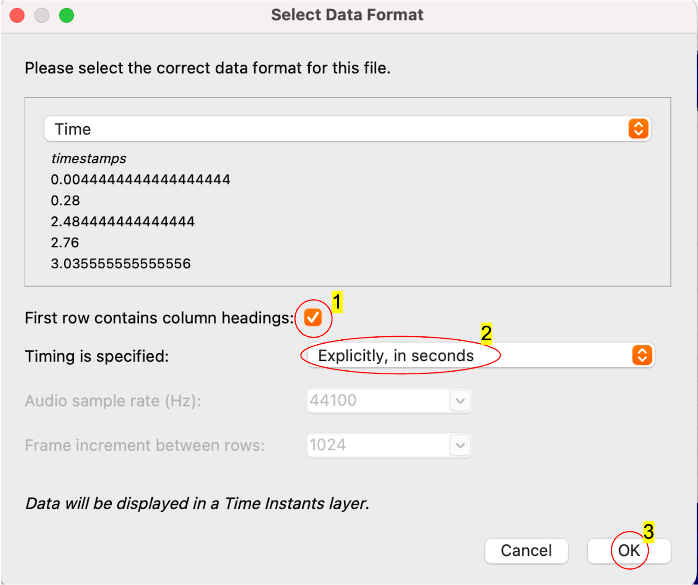
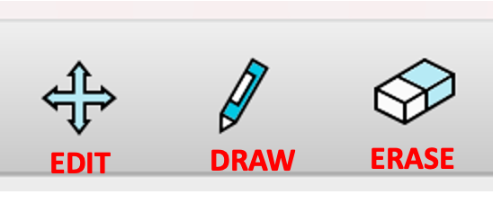

# Ornamentations in Hindustani Vocal Dataset

### Annotator Guide

Thank you for contributing to the **OHV annotation project**.
This guide explains how to access the audio files, annotate the audio, and export your annotations.

---

# 1. Software Requirement

Please install **Sonic Visualizer** for your operating system before starting.

You will use this tool to view the audio and create timestamp annotations.

---

# 2. Project Google Drive Structure

You will be given access to a shared Google Drive containing the following folders and files.

## Annotator Folder

Each annotator has their own folder after their name.

Export your **CSV annotation files** into your assigned folder.

Example:

```
GoogleDrive/
  AnnotatorFolder/
    Rhythm/
    Annotator2/
```

---

## StarterFiles Folder

Contains **Sonic Visualizer project files (.sv)**.

Each `.sv` file contains:

* the Saraga audio track
* existing reference regions

These are the files you will open and annotate.

---

## FilesToAnnotate.xlsx

This spreadsheet tracks which files are being annotated.

Columns include:

| Column            | Purpose                                           |
| ----------------- | --------------------------------------------------|
| Files             | Audio File name                                   |
| Raag              | the performed raag                                |
| Ready_to_annotate | Flag indicating if file is available to annotate  |
| Annotator1        | First annotator                                   |
| Annotator2        | Second annotator                                  |

### Choosing a File to Annotate

1. Look for rows where **Ready_to_annotate is green**.
2. Check if either **Annotator1 or Annotator2** is empty.
3. Enter your name in the **first available column**.
4. If both are filled, choose another file.

We aim to have **two independent annotators** per file.

---

# 3. Opening the file in Sonic Visualizer

1. Open **Sonic Visualizer**
2. Drag and drop:

   * the **mp3 audio file**
   * the **.sv starter file**
into the application.

If a dialog box appears while opening the `.sv` file, select the recommended import options.
<!--  -->


---

# 4. Annotation Tools

Annotations appear as **purple vertical lines** in the timeline.

If annotation tools are **grayed out**, click the **annotation layer in the right panel**.



---

## Edit Tool

Used to **label or move annotations**.

Steps:

1. Select the **Edit Tool**
2. Double click a **purple line**
3. Enter the annotation label
4. Click **OK**

Note: Only move annotations that **you added**.
Do **not modify original regions** in the starter file.

---

## Draw Tool

Used to **add new annotations**.

Click on the timeline to create a new purple marker.

---

## Erase Tool

Used to **delete annotations you added**.

Note: Do **not erase original annotations** provided in the starter file.

---

## Undo / Redo

Standard keyboard shortcuts work.

```
Undo  : Ctrl / Cmd + Z
Redo  : Ctrl / Cmd + Shift + Z
```

---

# 5. Saving Your Work

Save frequently to avoid losing work.

Recommended:

Save the `.sv` project file every **5–10 minutes**.

---

# 6. Exporting Annotations

Once you finish annotating:

1. Go to

```
File → Export Annotation Layer
```

2. Select **CSV format**

3. Name the file using this format:

```
filename_yourinitials.csv
```

Example:

```
raag_yaman_rj.csv
```

4. Upload the CSV to **your Annotator folder** in Google Drive.

---

# 7. Ornamentation Labeling Conventions

Use the following labels when marking ornamentation.

| Ornament | Start Label | End Label |
| -------- | ----------- | --------- |
| Kan      | k_s         | k_e       |
| Gamak    | g_s         | g_e       |
| Murki    | mu_s        | mu_e      |
| Meend    | me_s        | me_e      |
| Andolan  | a_s         | a_e       |
| Khatka   | kh_s        | kh_e      |
| Zamzama  | z_s         | z_e       |

---

## Compound Ornaments

If you think multiple ornaments occur in one region, please follow this convention while labeling them :

```
c_<name>_s
c_<name>_e
```

Example:

```
c_meend_gamak_s
c_meend_gamak_e
```

You may add additional markers if needed.

---

## Other Ornament Types

If an ornament is not in the list above:

```
o_<name>_s
o_<name>_e
```

Example:

```
o_khatka_s
o_khatka_e
```

---

## No Ornament

If the marked region has **no ornamentation**, label it as:

```
none
```

---

# 8. Questions or Issues

If you encounter any problems:

* annotation tools not working
* file loading issues
* unclear ornamentation labels

Please contact Rhythm Jain.

Suggestions for improving the annotation process are always welcome.

---

Thank you again for contributing to this dataset.
Your annotations are extremely valuable for improving research on **Hindustani vocal ornamentations**.
